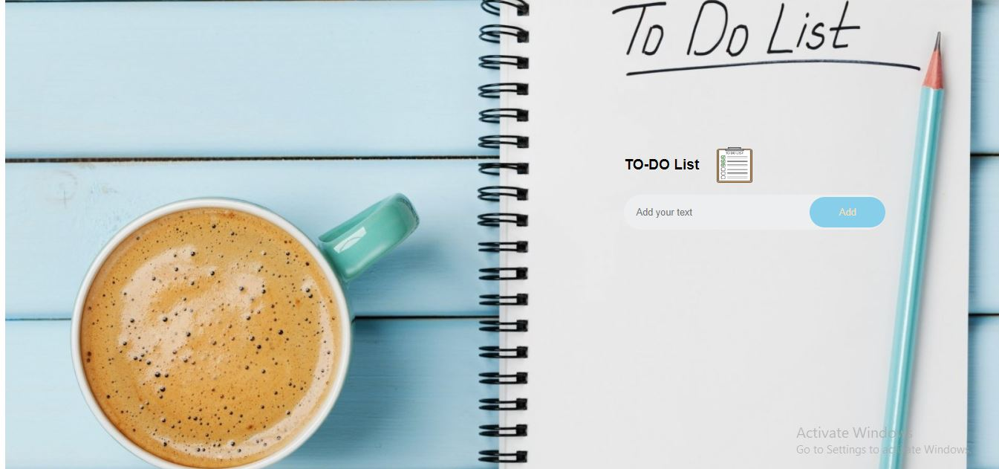
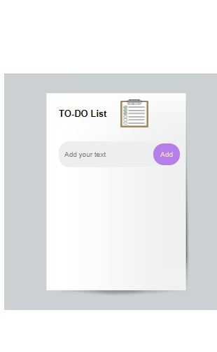

# To-do List

## Using HTML CSS and JS

### Laptop screen view



### Mobile screen view



## Project Description

### Features

1- You can add a to-do by clicking on the add button

2- You can delete a to-do by clicking on the the cross icon

3- You can check and uncheck your to-do by clicking in the check box

### Demo code for add function

#### Html code for add function

> This is a html code for adding a "add" button in to-do list

```
<div class="row">
                <input type="text" id="input_box" placeholder="Add your text">
                <button onclick="addTask()">Add</button>
</div>
```

#### Javascript code for add function

> This is a Js code to add a fuction behind the add button which adds your to-do

```

function addTask(){
if(inputbox.value == ""){
alert("You must write something");
}
else{
let li = document.createElement("li");
li.innerHTML = inputbox.value;
listcontainer.appendChild(li);
let span = document.createElement("span");
span.innerHTML = "\u00d7";
li.appendChild(span);
}
inputbox.value = ""
savedata()
}

```

### Demo code for delete function

> This is a Js code to build a cross icon in your to-do and and for deleting your to-do

```

listcontainer.addEventListener("click", function(e){

    if (e.target.tagName == "LI"){
        e.target.classList.toggle("checked");
        savedata()
        }
        else if(e.target.tagName == "SPAN"){
            e.target.parentElement.remove();
            savedata()
        }

},false);

```

### Project Details

1- This code also include stroing and displaying data

### Demo code for storing and displaying data

> This is Js code in which you can store your data in the localstorage of your system

```
 function savedata(){
        localStorage.setItem("data",listcontainer.innerHTML);
    }

    function showTask(){
        listcontainer.innerHTML = localStorage.getItem("data");
    }
    showTask()
```

2- For more details view full code

> [!NOTE]
> Keep in mind not to skip any step while adding a task

> [!TIP]
> A to_do list always helps you to remember your tasks

> [!WARNING]
> Your to-do should not contain phrase
> It should be words only
